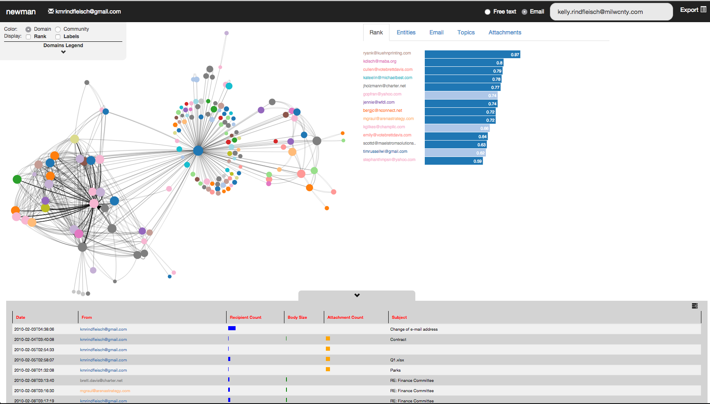

## Hellllllooooooo Newman...
A tool to quickly explore the history and network created by your email.

# Applied Technology
[Distributed Louvain Modularity](https://github.com/Sotera/distributed-louvain-modularity)  
[MITIE: MIT Information Extraction](https://github.com/mitll/MITIE)  
[Topic Clustering](https://github.com/mitll/topic-clustering)  
[ActiveSearch](https://github.com/AutonlabCMU/ActiveSearch)  
[Tangelo](http://tangelo.kitware.com)  
[Icons](https://www.iconfinder.com/iconsets/document-icons-2)  
